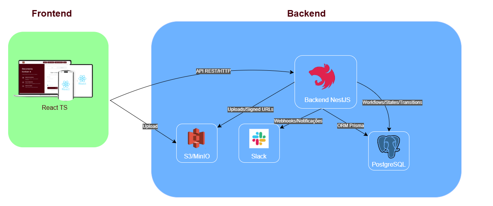

# Reconecta Kanban

<div align="center">

  

</div>

<h1 align="center">
 <a href="#">website view - Reconecta Kanba</a>
</h1>

# 🎯 Reconecta Kanba

>Construir um sistema dinâmico de ocorrências e projetos onde equipes possam definir fluxos de trabalho configuráveis, gerenciar ocorrências via Slack, criar projetos/tarefas com múltiplos responsáveis e documentação (arquivos e URLs).

## 🏗️ Arquitetura




## 💻 Como Executar o Projeto

Siga os passos abaixo para rodar o projeto localmente:

1. **Clone o repositório**  
```bash
git clone https://github.com/reconecta-kanbam/reconecta-kanbam-frontend
```
2. **Entre na pasta do projeto**
```bash
cd ./NomedoArquivo
```
3. **Instale as dependências**
```bash
npm install
# ou
yarn install
```
4. **Inicie o servidor de desenvolvimento**
```bash
npm start
# ou
npm run dev
```

## Criar nova branch

Siga os passos abaixo para rodar o criar sua Branch:

1. Crie a nova branch

```
Lembre de manter o padrão "feature-"
git checkout -b feature-nome-que-voce-vai-add
```

2. No VSCode, no canto inferior esquerdo, você verá a branch atual em que está trabalhando. Verifique se ela mostra o nome correto da nova branch, por exemplo:

```
feature-filtro-do-mapa
```

3. Adicione as alterações

```
git add .
```

4. Faça o commit com a mensagem adequada

```
git commit -m "Adiciona funcionalidade...."
```

5. Empurre a nova branch para o repositório remoto

```
git push origin feature-nome-que-voce-vai-add
```

## Documentação

<a href="https://docs.google.com/document/d/1jbZXKijIYzSUKSWUi4DA_-0OBQg9qu1dOLG2O2YvulE/edit?tab=t.0">Documentação Doc. </a>
